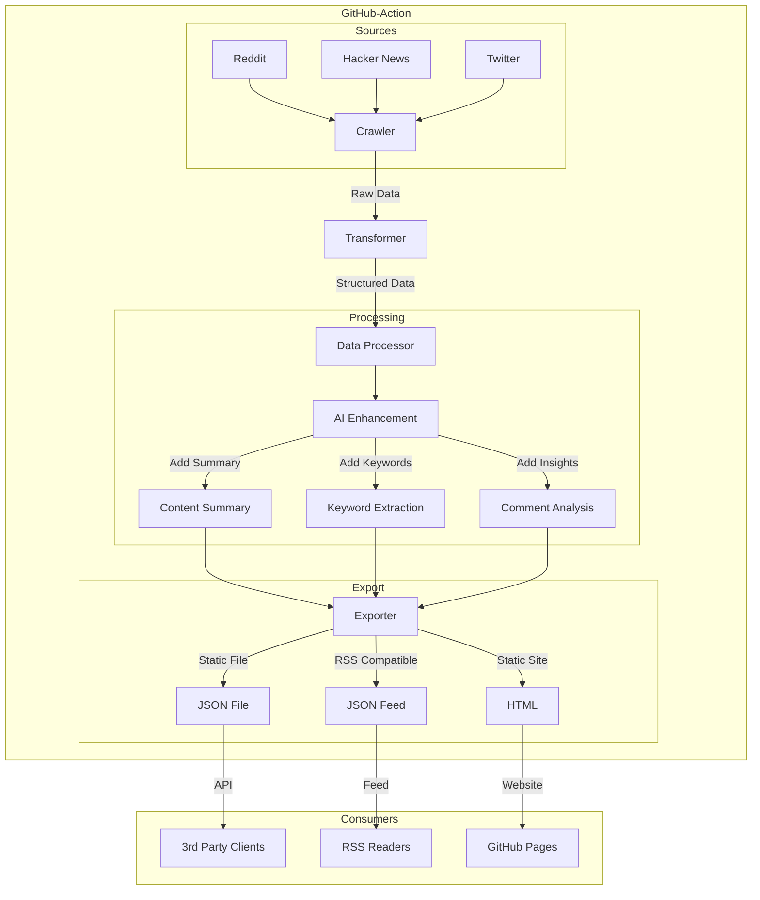

# Intro
A real-time social media trend analyzer that tracks public discussions and sentiment across major platforms. The system aggregates content and transforms it into structured data, enhanced with AI-generated insights.

# Key Features
- List of social media websites: hacker news, reddit, twitter, etc.
- AI generated structured data including comments trending.
- LLM friendly data output, great for developers to build their own applications based on the data.

# Tech
The content will be transformed into a unified format like:
```
{
    "title": "title",
    "url": "url",
    "content": "content", // optional
    "comments": [
        {"content": "comment content", "author": "comment author"}
    ],
    "published": "2025-01-10T09:51:07.769Z",
    "modified": "2025-01-10T09:51:07.769Z",
    // ai generated fields below
    "summary": "the summary of (the content of the url, title)",
    "summary_comment": "the key idea of the comments", // optional
    "keywords": ["keyword1", "keyword2", "keyword3"] // optional
}
```


