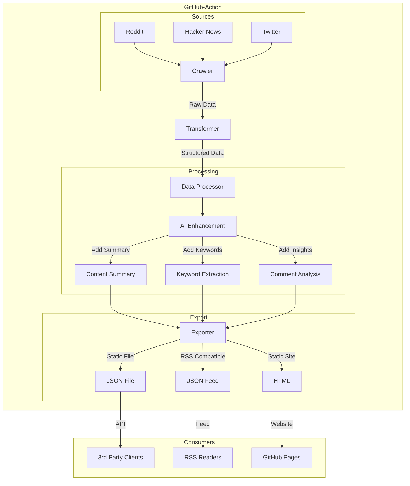

> all the docs in this folder are for the llm

# Tech

```mermaid
graph TD
    subgraph GitHub-Action
        subgraph Sources
            A1[Reddit]
            A2[Hacker News]
            A3[Twitter]
            A1 & A2 & A3 --> A[Crawler]
        end

        A --> |Raw Data| B[Transformer]
        B --> |Structured Data| C[Data Processor]
    
        subgraph Processing
            C --> D[AI Enhancement]
            D --> |Add Summary| E[Content Summary]
            D --> |Add Keywords| F[Keyword Extraction]
            D --> |Add Insights| G[Comment Analysis]
        end
        
        subgraph Export
            E & F & G --> H[Exporter]
            H --> |Static File| I[JSON File]
            H --> |RSS Compatible| J[JSON Feed]
            H --> |Static Site| K[HTML]
        end
    end

    subgraph Consumers
        I --> |API| L[3rd Party Clients]
        J --> |Feed| M[RSS Readers]
        K --> |Website| X[GitHub Pages]
    end
```
