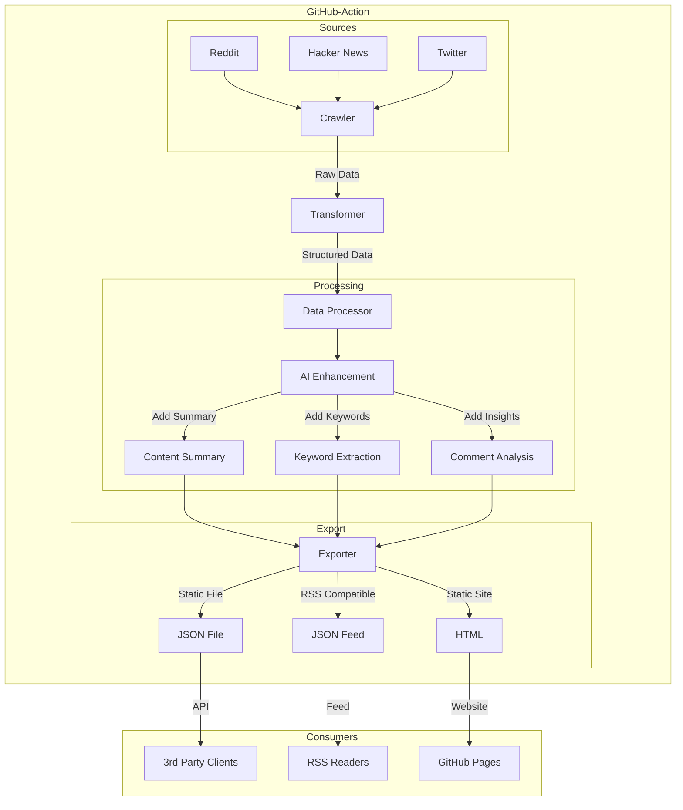

> all the docs in this folder are for the llm

# Tech
The content will be transformed into a unified format like:
```
{
    // original data
    "title": "title",
    "url": "url",
    "content": "content", // optional
    "comments": [
        {"content": "comment content", "author": "comment author"}
    ],
    "published": "2020-01-02T03:04:05Z", // optional
    /////////////////////////////
    "id": "id", // original id or generated id based on the url, for cache and deduplication with local db
    "created": "2025-01-10T09:51:07Z", // the fetched time
    "updated": "2025-01-10T09:51:07Z", // the last updated time, e.g. updated the comments
    // ai generated fields below
    "summary": "the summary(the content of the url, title)",
    "summary_comment": "the key idea of the comments", // optional
    "keywords": ["keyword1", "keyword2", "keyword3"] // optional
}
```


