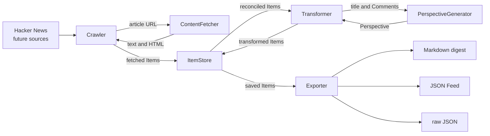

> Architecture reference optimized for LLM readers.

# Pipeline

```mermaid
flowchart LR
    Source["Hacker News<br>future sources"] --> Crawler
    Crawler -->|article URL| ContentFetcher
    ContentFetcher -->|text and HTML| Crawler
    Crawler -->|fetched Items| ItemStore
    ItemStore -->|reconciled Items| Transformer
    Transformer -->|title and Comments| PerspectiveGenerator
    PerspectiveGenerator -->|Perspective| Transformer
    Transformer -->|transformed Items| ItemStore
    ItemStore -->|saved Items| Exporter
    Exporter --> Markdown["Markdown digest"]
    Exporter --> JsonFeed["JSON Feed"]
    Exporter --> RawJson["raw JSON"]
```

Runtime order: `crawl → reconcile → transform → save → export`.

- Crawler is source-specific and receives a ContentFetcher; no crawler inheritance.
- ContentFetcher moves its synchronous extraction fallback chain to a worker thread.
- ItemStore owns Reconcile and persistence across runs.
- Transformer reaches the LLM only through PerspectiveGenerator.
- PerspectiveGenerator owns Refresh thresholds and structured response parsing.
- Exporter is pure; the entrypoint supplies feed identity and performs file I/O.
